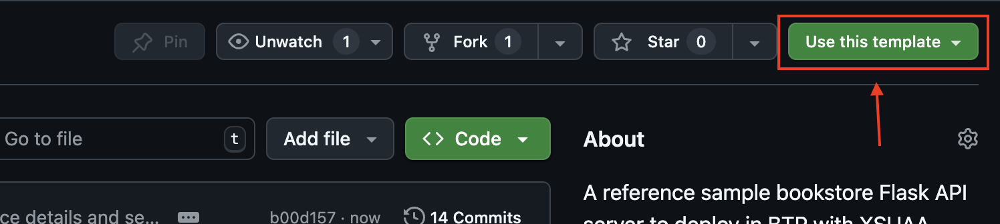

# 🚀 **SAP BTP Flask Starter App**

### **Build Production-Ready Flask Apps on SAP BTP with Ease!**

---

## 🌟 **Introduction**

Welcome to the **SAP BTP Flask Starter App**! This repository is your one-stop solution for building and deploying production-grade Flask applications on SAP Business Technology Platform (BTP). With built-in support for **XSUAA authentication & authorization**, **HANA database integration**, and **MTA deployment**, this project is designed to help developers—both beginners and experts—hit the ground running. 🎉

---

## ✨ **Features**

- **🧑‍💻 Friendly Developer-Experience (DX)**
  Developer Experience was the top goal of this project. Use **Basic Auth** for _local_ development while using **XSUAA Auth** for _production_. Similarly, use **SQLite** for _local_ development while using **SAP HANA** for _production_.

- **🔒 XSUAA Authentication & Authorization**  
  Secure your app with SAP's XSUAA service for seamless authentication and role-based access control.

- **🛠️ HANA Integration**  
  Leverage SAP HANA for robust database management with SQLAlchemy and [`@sap/cds-dk`](https://www.npmjs.com/package/@sap/cds-dk) for HDI artifact generation.

- **📦 MTA Deployment**  
  Effortlessly deploy your app using the [Multi-Target Application (MTA) framework](https://help.sap.com/docs/btp/sap-business-technology-platform/multitarget-applications-in-cloud-foundry-environment).

- **⚡ Local & Production Configurations**  
  Automatically adapt to local or production environments with minimal setup by setting `FLASK_ENV` environment variable

- **📋 CF Logging**  
  Integrated Cloud Foundry logging for better observability using [`cf-python-logging-support`](https://github.com/SAP/cf-python-logging-support)

- **🚀 Gunicorn for Production**  
  Run your app with the high-performance [Gunicorn WSGI server](https://gunicorn.org/) in production.

- **🩺 Health Check Endpoint**  
  Monitor app and database liveliness via the `/health` endpoint.

---

## 🤔 **Why Use This Repository?**

- **Time-Saving**: Pre-configured for SAP BTP, so you can focus on building features.
- **Best Practices**: Implements SAP standards for BTP apps.
- **Scalable**: Designed to grow with your application needs.
- **Beginner-Friendly**: Easy-to-follow setup and documentation.

---

## 🏁 **How to Use This Repository**

This repository is a **template repository**. To start your own project based on this starter app:

1. Click the green **"Use this template"** button at the top of the [GitHub repository page](https://github.com/anselm94/sapbtp-flask-bookstore-template).
   
2. Choose **"Create a new repository"** and fill in your desired repository name and settings.
3. Follow the [Getting Started](#getting-started) instructions below to set up your environment.

> [!TIP]
>
> Using the template ensures you start with a clean commit history and can customize your project independently.

---

## 🛠️ **Getting Started**

### **Pre-requisites**

1. Install [NodeJS](https://nodejs.org/en/download).
2. Install [`poetry`](https://python-poetry.org/docs/#installation) for dependency management.
3. Install [CF CLI](https://docs.cloudfoundry.org/cf-cli/install-go-cli.html).

### **Setup**

1. **Clone the Repository**

   ```bash
   git clone https://github.com/anselm94/sapbtp-flask-bookstore.git
   cd sapbtp-flask-bookstore
   ```

2. **Create and Activate a Virtual Environment**

   ```bash
   python -m venv .venv
   source .venv/bin/activate
   ```

3. **Install [`cds-dk`](https://cap.cloud.sap/docs/tools/cds-cli) & [`mbt`](https://sap.github.io/cloud-mta-build-tool/) tooling**

   ```bash
   npm install
   ```

4. **Deploy DB artefacts**

   Deploy DB artefacts to local SQLite DB file.

   ```bash
   # in root project dir
   npm run deploy:sqlite
   ```

   > [!NOTE]
   >
   > You must repeat the above command everytime for every CDS file change in [`db/`](db/) folder

5. **Install Poetry Dependencies**

   ```bash
   cd srv && poetry install
   ```

6. **Start the Local Server**

   The local server starts with SQLite as DB and Basic User (username: `me` & password: `me`)

   ```bash
   # in `srv` folder
   python -m flask run
   ```

7. **Test the API**

   - Health Check

   ```http
   GET http://127.0.0.1:5000/health
   ```

   - Get `books` API

   ```http
   GET http://127.0.0.1:5000/api/v1/books

   Authorization: Basic me:me
   ```

8. **Run Tests**

   ```bash
   # in `srv` folder
   python -m pytest
   ```

9. **See Coverage Reports**

   - Open generated HTML coverage reports in [`srv/htmlcov/`](srv/htmlcov/) folder

### **Deploy to Cloud Foundry**

1. **Build the MTA Project**

   ```bash
   # in project root dir
   mbt build
   ```

2. **Push the Artefact**

   ```bash
   # in project root dir
   cf deploy mta_archives/sapbtp-flask-bookstore_1.0.0.mtar
   ```

3. **Test the API**

   Check the BTP Cockpit for the URL.

   - Health Check

   ```http
   GET https://<BTP_APP_DEPLOYMENT_URL>/health
   ```

   - Get `books` API

   Get an `oauth2_token` before running the following check

   ```http
   GET http://<BTP_APP_DEPLOYMENT_URL>/api/v1/books

   Authorization: Bearer <oauth2_token>
   ```

> [!TIP]
>
> In order to replicate the `PRODUCTION` in the local by connecting to HANA DB and use oAuth2 authentication flow, you can replicate the `VCAP_SERVICES` in the local and set `FLASK_ENV=PRODUCTION`. See [`config.py`](./srv/config.py) for more info
>
> 1. Copy [`.env.example`](./.env.example) to `.env`
> 2. Run the setup script to populate `VCAP_SERVICES`
>    ```bash
>    sh setup-env.sh
>    ```
> 3. Run the app locally
>    ```bash
>    cd srv
>    FLASK_ENV=PRODUCTION python -m flask run
>    ```
> 4. Test the API with oAuth2 credentials

---

## 📂 **Project Structure**

```plaintext
sapbtp-flask-bookstore/
├── db/                               # CDS schema and data files
│   ├── schema.cds                    # Core Data Services (CDS) schema definition
│   ├── data/                         # Sample data for the database
├── gen/                              # Generated HANA artifacts
├── srv/                              # Flask application source code
│   ├── app.py                        # Entry point for the Flask application
│   ├── config.py                     # Configuration management for different environments
│   ├── app/                          # Application modules
│   │   ├── database.py               # Database connection and setup logic
│   │   ├── models.py                 # ORM models for database tables
│   │   ├── routes/                   # API route definitions
│   │   │   ├── __init__.py           # Route initialization
│   │   ├── services/                 # Business logic and service layer
│   │   │   ├── books_service.py      # Service logic for book-related operations
│   │   ├── utils/                    # Utility functions for authentication and error handling
│   │   │    ├── auth_utils.py        # Authentication helper functions
|   │   │    ├── heathcheck_utils.py  # Healthcheck helper functions
│   ├── tests/                        # Unit Tests
├── mta.yaml                          # MTA deployment descriptor
├── setup-env.sh                      # Script to configure local environment
└── README.md                         # Project documentation
```

---

## 🔍 **How It Works**

1. **Authentication & Authorization**

   - Use `@login_required` for any route, which needs **authentication**
   - Use `@roles_required(["role-1", "role-2"])` for any route, which needs necessary scope **authorization**

   **Local Development**

   - Uses _Basic Auth_ for quick and easy development in the local - See [`srv/config.py`](srv/config.py), [`srv/app/routes/__init__.py`](srv/app/routes/__init__.py) & [`srv/app/utils/auth_utils.py`](srv/app/utils/auth_utils.py)
   - Validate Role-based access control as defined for mock users in [`srv/config.py`](srv/config.py)
   - Configure default mock users and roles in [`srv/config.py`](srv/config.py)

   **Production**

   - Uses _SAP XSUAA_ for OAuth2-based authentication & authorization - See [`srv/config.py`](srv/config.py), [`srv/app/routes/__init__.py`](srv/app/routes/__init__.py) & [`srv/app/utils/auth_utils.py`](srv/app/utils/auth_utils.py)
   - Role-based access control is defined in [`xs-security.json`](./xs-security.json).

2. **Database Integration**

   - All DB artefacts are modelled in [SAP CDS - Conceptual Definition Language](https://cap.cloud.sap/docs/cds/cdl) format - See [`db/schema.cds`](db/schema.cds)
   - Uses [`@sap/cds-dk` CLI](https://cap.cloud.sap/docs/tools/cds-cli) for compiling CDS CDL to target DB DDL format and deploy them at ease.
   - [SQLAlchemy](https://flask-sqlalchemy.readthedocs.io/en/stable/) is used for ORM mapping in the Flask app ([`srv/app/models.py`](./srv/app/models.py)) using 'SQLite dialect' or '[SAP HANA dialect](https://github.com/SAP/sqlalchemy-hana)'.
   - Easily load default CSV data configurations - see [`db/data/`](db/data/)
   - CDS models ([`db/schema.cds`](./db/schema.cds)) are converted to HANA HDI artifacts using [`@sap/cds-dk`](https://www.npmjs.com/package/@sap/cds-dk).

   **Local Development**

   - Run `npm run deploy:sqlite` in the root project dir to deploy the latest CDS changes in [`db/`](db/) folder to the local SQLite DB files.

   **Production**

   - Use [SAP HANA Deployer - `@sap/hdi-deploy`](https://help.sap.com/docs/SAP_HANA_PLATFORM/4505d0bdaf4948449b7f7379d24d0f0d/1b567b05e53c4cb9b130026cb2e7302d.html) for automated HANA artefact migration and deployment

3. **Health Checks**

   - Checks for dependent services' availability for health check endpoint `/health` - see [`srv/app/utils/heathcheck_utils.py`](srv/app/utils/heathcheck_utils.py)

4. **Automated Tests**

   - Uses [`pytest`](https://docs.pytest.org/en/stable/) framework with [`pytest-flask`](https://pytest-flask.readthedocs.io/en/latest/) for automated tests.
   - Uses [`pytest-cov`](https://pytest-cov.readthedocs.io/en/latest/readme.html) for coverage reporting

5. **Deployment**

   - MTA framework bundles the app, database, and services for deployment.
   - [`cf deploy`](https://docs.cloudfoundry.org/devguide/deploy-apps.html) handles the deployment to SAP BTP.

---

## 🧑‍💻 **Development Workflow**

- **Debugging**: Use VS Code's built-in debugger with the provided `launch.json`.
- **Extending**:
  - Add new routes in [`srv/app/routes/`](./srv/app/routes/__init__.py)
  - Add new services in [`srv/app/services/`](./srv/app/services/).
  - Add new models in [`db/schema.cds`](./db/schema.cds) and [`srv/app/models.py`](./srv/app/models.py)

---

## 📜 **License**

This project is licensed under the [MIT License](./LICENSE).

---

## 🙌 **Acknowledgments**

Special thanks to the SAP BTP community and contributors for their support and inspiration!
